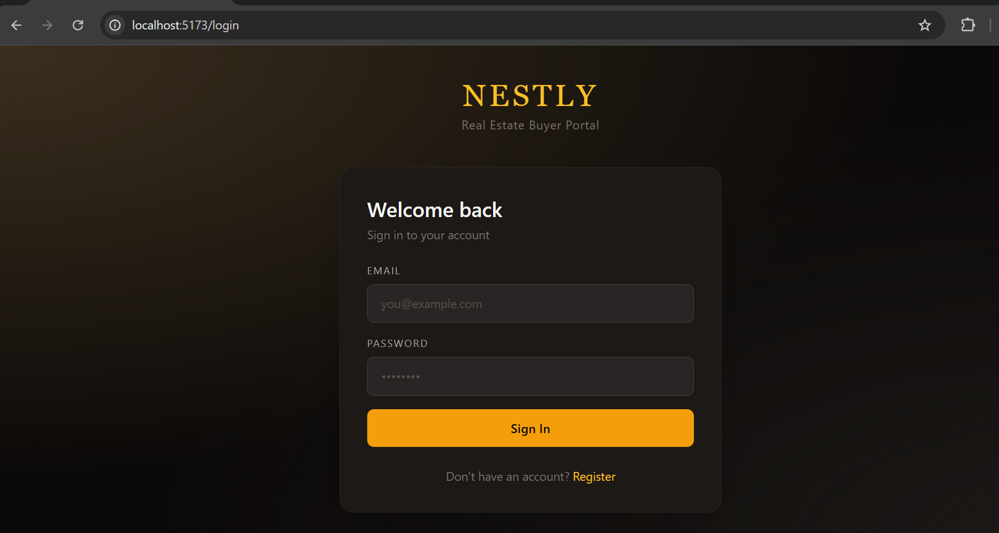
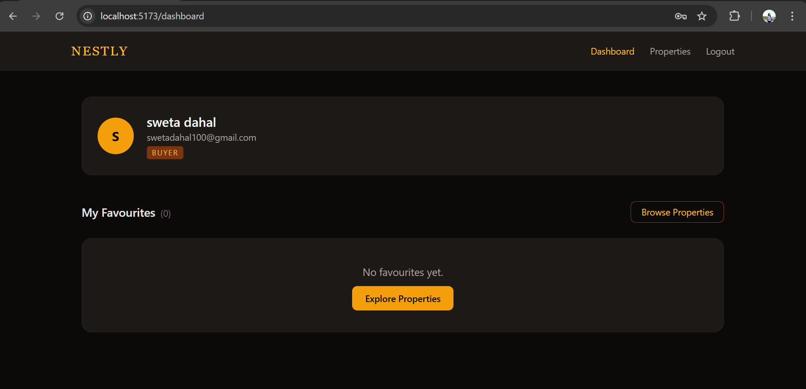
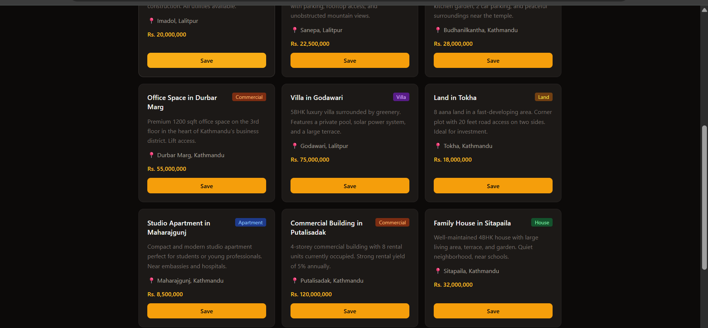
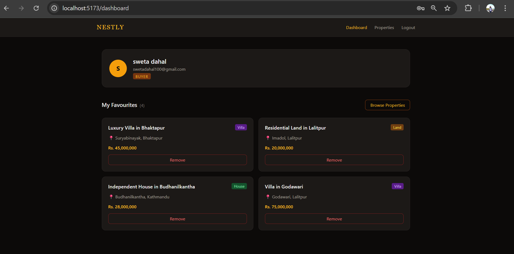

```md
# Nestly — Buyer Portal

A simple and functional **real-estate buyer portal** where users can sign up, log in, and manage their favorite properties.

Built as part of a **Junior Full-Stack Engineer technical assessment**, focusing on clean architecture, security, and usability.

---

##  Features

-  User Authentication (Register/Login)
- Personalized Dashboard
- Add/Remove Favorite Properties
-  User-specific data access (authorization)
-  Clean API with validation & error handling

---

##  Tech Stack

**Frontend**
- React (Vite)
- TypeScript
- Axios

**Backend**
- Node.js
- Express
- TypeScript

**Data Layer**
- In-memory DB (easy to extend)

---

## Project Structure

```

root/
│
├── backend/              # Express API (Port 5000)
├── frontend/BUYERPORTAL  # React App (Port 5173)
└── README.md

````

---

## Setup & Run

### 1. Clone Repo

```bash
git clone https://github.com/swetasd927/BuyerPortal.git
cd BuyerPortal
````

---

### 2. Run Backend (Port 5000)

```bash
cd backend
npm install
npm start
```

 [http://localhost:5000](http://localhost:5000)

---

### 3. Run Frontend (Port 5173)

```bash
cd frontend/BUYERPORTAL
npm install
npm run dev
```

 [http://localhost:5173](http://localhost:5173)

---

##  Key Implementation Details

* **Password Security**

  * Passwords are hashed (no plain text storage)

* **Authorization**

  * Users can only access and modify their own favorites

* **Clean Architecture**

  * Separation of routes, middleware,  and DB layer

* **Error Handling**

  * Clear success and error responses

---

##  Screenshots

### Login & Register
<p align="center">
  
</p>

---

### Dashboard
<p align="center">
  
</p>

---

### All Listed Properties
<p align="center">
  
</p>

---

###  Add / Remove Favorites (Dashboard)
<p align="center">
  
</p>

---

###  Create Account / Sign In Flow
<p align="center">
  
</p>

##  Example Flow

1. Register a new account
2. Login with credentials
3. Access dashboard
4. Browse properties
5. Add/remove favorites
6. View personalized favorites list
---

##  Future Improvements
* UI/UX improvements
* Search & filters
* Admin dashboard

---

### Author

**Sweta Dahal**

```

---
